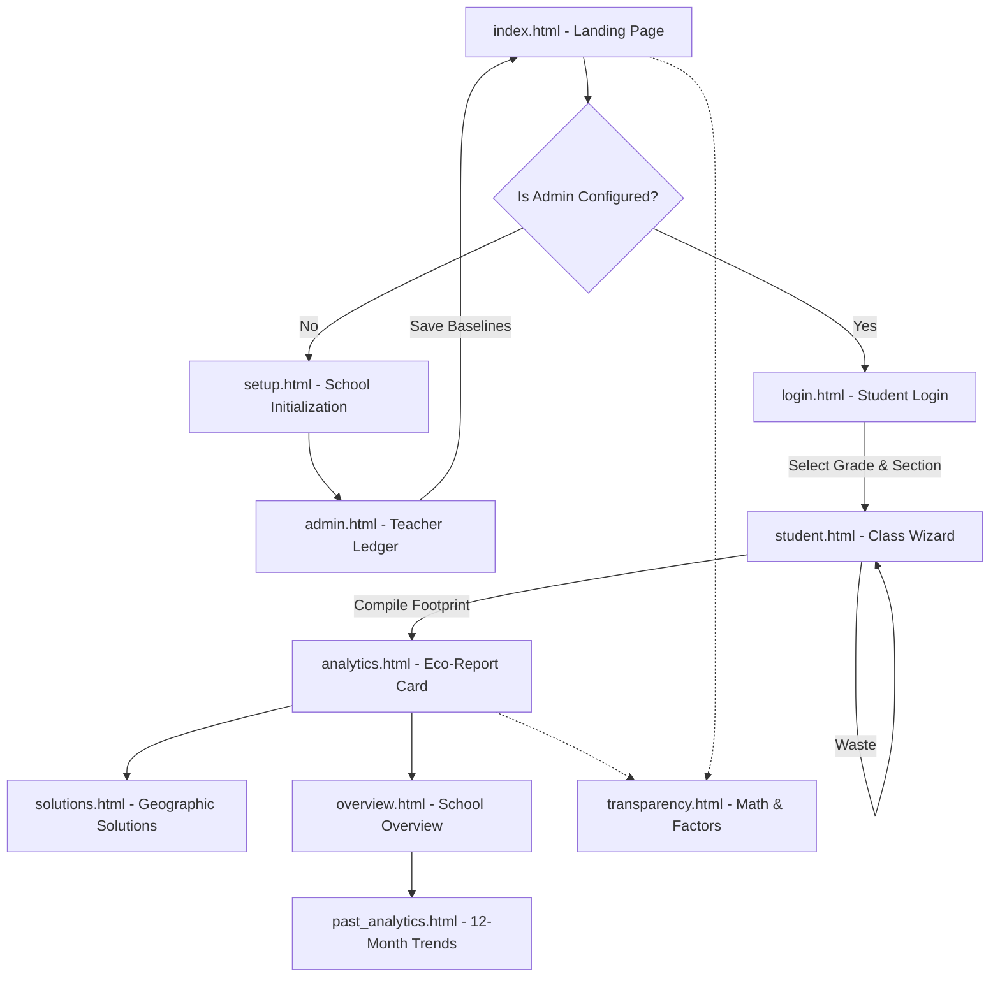

# Eco-Tracks Nepal: System Workflow & Page Flow

The Eco-Tracks Nepal application is designed around two primary user personas: **Administrators/Teachers** and **Students/Class Representatives**. The system enforces a strict prerequisite flow where the Admin must configure the school before students can begin tracking.

## 🔄 High-Level System Flow

---

## 🧭 Detailed Page Flow by User Journey

### 1. The Onboarding Journey (Admin / Teacher)
Before any student can use the application, an administrator must initialize the school profile and set the environmental baselines.

1.  **`index.html` (The Hub):** The user arrives at the homepage. If they attempt to enter the Student Portal without prior setup, they are blocked.
2.  **`setup.html` (Initialization):** If no config exists, the system routes the user here. They select their School Name, Reporting Month, and critically, their **Geographic District/Region** (Mountain, Hilly, or Terai). This region drives the logic for emission calculations and climate solutions.
3.  **`admin.html` (Teacher's Operations Ledger):** The admin inputs whole-school utility data for the month (Electricity kWh, Water Liters, LPG Cylinders, Diesel, and overall waste disposal methods). Once saved to LocalStorage, the system unlocks the student portal.

### 2. The Tracking Journey (Student / Class Rep)
This is the core loop of the application, performed daily or weekly by a representative for a specific class section.

1.  **`login.html` (Student Login):** The student selects their specific Grade (e.g., Grade 5) and Section (e.g., A) to begin their tracking session.
2.  **`student.html` (Class Data Portal):** A 4-step wizard form where the student logs their class's activity:
    *   **Step 1:** Demographics (Total students present today).
    *   **Step 2:** Commute Log (How many students walked, cycled, took the bus, or came by private car/motorbike).
    *   **Step 3:** Resource Log (New paper notebooks consumed and recycling habits).
    *   **Step 4:** Waste Path (A 5-point scale tracking open burning, pit burial, composting, and external recycling).
3.  **Compilation Phase:** Upon clicking "Compile Footprint", the `calculator_engine.js` processes the inputs against the `emission_factors.json` to calculate the kg CO₂e for that session. The record is saved into the history via `storage_manager.js`.

### 3. The Analytics & Action Journey (Post-Submission)
After logging data, the system provides immediate feedback and actionable next steps.

1.  **`analytics.html` (Eco-Report Card):** The user is immediately redirected here after submission. They are presented with:
    *   A **Performance Grade** (A+ to E) and the number of Trees Equivalent needed to offset their emissions.
    *   A **Hotspot Alert** identifying the single worst-performing category (e.g., Waste, Commute).
    *   A comparative **Bar Chart** showing current emissions vs. the previous session.
2.  **`solutions.html` (Geographic Solutions):** Triggered from the Hotspot Alert on the analytics page. It reads the school's configured ecological zone (e.g., Mountain) and presents highly specific, localized mitigation strategies (e.g., "Build enclosed leaf-insulated composting chambers" for Mountain regions vs "Organize a flat-terrain bicycle sharing network" for Terai).
3.  **`overview.html` & `past_analytics.html` (School-Wide Review):** Used by admins or curious students to see the aggregate footprint of the entire school across all grades, including a 12-month historical line chart of trends.
4.  **`transparency.html`:** Accessible from any page footer/nav. It provides a breakdown of the exact mathematical formulas and data sources used, ensuring transparency and trust in the system's tracking.
